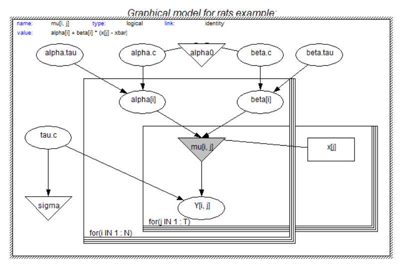
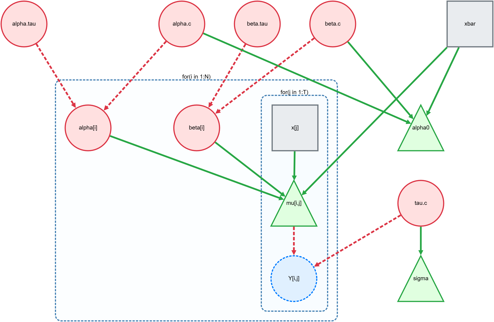

## TL;DR

- BUGS is a domain-specific language for Bayesian models; JuliaBUGS is its modern Julia implementation. DoodleBUGS is a browser-based graphical interface for JuliaBUGS.
- Outcomes: working visual editor, legacy BUGS export that compiles with JuliaBUGS, local execution via a Julia backend, unified standalone script generation, timeouts, multiple layouts (Dagre [default], fCoSE, Cola, Klay), and a cleaned-up, typed codebase.
- For architecture, execution, and API details, see the companion technical post: [DoodleBUGS: Introduction](/DoodleBUGS-Introduction/).
- Try it here (static UI): [https://turinglang.org/JuliaBUGS.jl/DoodleBUGS/](https://turinglang.org/JuliaBUGS.jl/DoodleBUGS/)
- Default timeout is 0 (disabled); configurable in Execution Settings.

## Motivation

[JuliaBUGS](https://github.com/TuringLang/JuliaBUGS.jl) is a modern Julia implementation of the BUGS language [@bugs-rjournal; @bugs-book; @bugs-project]. DoodleBUGS revives the original visual modeling concept with a modern browser-based stack so users can:

- Construct probabilistic graphical models visually (nodes, edges, plates).
- Export readable legacy BUGS code that compiles with JuliaBUGS [@JuliaBUGS; @bugs-rjournal; @bugs-book].
- Run inference and inspect results from the UI. Common BUGS applications include parallel MCMC [@multibugs], survival analysis [@bugs-survival], and Gibbs-style samplers [@albert-chib-1993; @informs-gibbs].

## What Was Built

- Visual editor
  - Node types: stochastic, observed, deterministic
  - Plates with arbitrary nesting; robust drag-in/out and creation inside plates
  - Graph layouts:
    - Dagre (Hierarchical) [default]
    - fCoSE (Force-Directed)
    - Cola (Physics Simulation)
    - Klay (Layered)
- Legacy BUGS code generation [@bugs-rjournal; @bugs-book]
  - Topological ordering and plate-aware traversal
  - Parameter formatting and safe index expansion
- Execution flow (high-level)
  - Frontend generates legacy BUGS `model_code` plus `data`, `inits`, `settings` and can generate a standalone Julia script.
  - When connected, it sends a JSON payload to the Julia backend at `/api/run` (alias: `/api/run_model`).
  - Backend compiles via `JuliaBUGS.@bugs` and runs sampling with `AdvancedHMC.NUTS` through `AbstractMCMC`; returns summaries/quantiles as JSON.
- Resilience and ergonomics
  - Configurable timeouts (default 0 = disabled); safe temp cleanup on Windows
  - Unified standalone script generation lives in the frontend

## Why Vue (not React)?

The proposal planned React; we chose Vue 3 after evaluating the graph layer and developer velocity for this app.

- Konva (canvas) required bespoke graph semantics (hit testing, edge routing, compound nodes) that [Cytoscape.js](https://js.cytoscape.org/) already provides.
- D3 layouts are flexible, but compound nodes (plates), nesting, and drag constraints became significant custom work.
- [Cytoscape.js](https://js.cytoscape.org/) offered native compound nodes (great for plates), integrated layouts (Dagre [default], fCoSE, Cola, Klay), and mature performance [@webcola; @elk].
- [Vue 3](https://vuejs.org/) with the Composition API made integrating Cytoscape straightforward via composables and lifecycle hooks; Pinia stores + SFC ergonomics improved iteration speed.

## Comparison to Legacy DoodleBUGS

The legacy tool was a desktop application driving WinBUGS [@winbugs]; the new DoodleBUGS is a browser-based editor targeting JuliaBUGS [@JuliaBUGS]. Key differences:

- Platform and backend
  - Legacy: Desktop UI, WinBUGS execution pipeline
  - New: Web UI, Julia backend via `JuliaBUGS.@bugs`, sampling with `AdvancedHMC.NUTS` through `AbstractMCMC`
- Graph engine and plates
  - Legacy: Bespoke graph handling with limited nesting semantics
  - New: [Cytoscape.js](https://js.cytoscape.org/) with compound nodes for robust nested plates; custom Drag and Drop for drag-in/out and creating inside plates. Overlapped plates (multiple parents) are not supported; tracked here: [https://github.com/TuringLang/JuliaBUGS.jl/issues/362](https://github.com/TuringLang/JuliaBUGS.jl/issues/362)
- Layouts and interactions
  - Legacy: Limited auto-layout support
  - New: Multiple layout engines and stable interactions:
    - Dagre (Hierarchical) [default]
    - fCoSE (Force-Directed)
    - Cola (Physics Simulation)
    - Klay (Layered)
- Code generation
  - Legacy: Export to BUGS without strong ordering guarantees
  - New: Deterministic topological + plate-aware traversal; parameter canonicalization and safe index expansion
- DevX and maintainability
  - New: Vue 3 + TypeScript + Pinia; unified standalone script generation on the frontend; leaner backend responses

## Progress vs Proposal

- Implemented
  - Visual editor with nested plates and robust Drag and Drop
  - BUGS code generator (topological + plate-aware)
  - Local execution + summaries/quantiles (summary includes mean, std, mcse, ess_bulk, ess_tail, rhat, etc.)
  - Unified standalone script generation (frontend)
  - Timeouts/resilience
  - Multiple layouts and interactions (Dagre [default], fCoSE, Cola, Klay)
  - Extensive cleanup/typing
- Changed
  - Vue 3 instead of React
  - Backend responses smaller; no standalone script attachment
- Deferred/Partial
  - Visualization: integrate with MCMCChains.jl for plotting. R-hat and ESS are already included in the summary statistics.
  - WebKit/Safari support
  - UX polish for large graphs

## Cross-links

- For architecture, execution, API, and how-to-run details, see the companion technical post: [DoodleBUGS: Introduction](/DoodleBUGS-Introduction/).

## Acknowledgements

Much appreciation goes to my mentors Xianda Sun and Hong Ge. The work is impossible without your help and support.

- Mentors: Xianda Sun ([\@sunxd3](https://github.com/sunxd3)) and Hong Ge ([\@yebai](https://github.com/yebai))
- TuringLang/JuliaBUGS community and contributors

## Appendix: Links

- Repo: [https://github.com/TuringLang/JuliaBUGS.jl](https://github.com/TuringLang/JuliaBUGS.jl)
- Try it here (static UI): [https://turinglang.org/JuliaBUGS.jl/DoodleBUGS/](https://turinglang.org/JuliaBUGS.jl/DoodleBUGS/)
