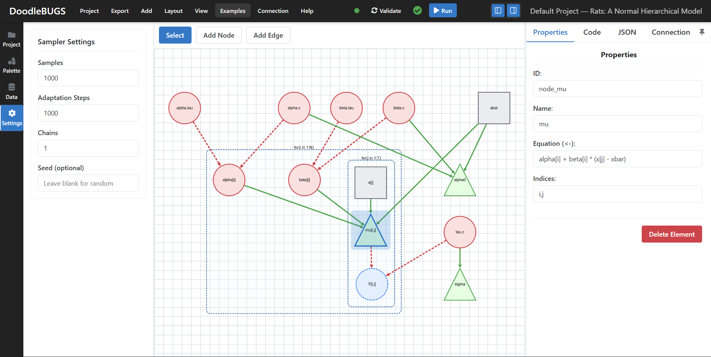

## TL;DR

- This page is the technical companion to the GSoC report. For the high-level story and outcomes, see: [DoodleBUGS: GSoC 2025 Report](/DoodleBUGS-GSoC-2025-Report/).
- Contents here: project structure, frontend/backend architecture, execution flow, how to run locally, API summary, current limitations, and future work.

## DoodleBUGS Project Structure

```{.bash}
DoodleBUGS/                # Vite + Vue 3 app (UI editor)
├── README.md              # project documentation
├── public/                # static assets served by Vite
│   └── examples/          # example projects
├── experiments/           # prototypes and exploratory work
├── runtime/               # Julia HTTP backend (API endpoints & dependencies)
├── src/                   # application source
│   ├── assets/            # styles and static assets
│   ├── components/        # Vue components composing the UI
│   │   ├── canvas/        # graph canvas and toolbars
│   │   ├── common/        # shared UI primitives
│   │   ├── layouts/       # app layout and modals
│   │   │   └── MainLayout.vue   # main application layout
│   │   ├── left-sidebar/  # palette, project manager, execution settings
│   │   ├── panels/        # code preview and data input panels
│   │   ├── right-sidebar/ # execution, JSON editor, node properties
│   │   └── ui/            # base UI elements (buttons, inputs, selects)
│   ├── composables/       # reusable logic (codegen, drag & drop, graph, validator, grid)
│   ├── config/            # configuration and node definitions
│   ├── stores/            # Pinia state stores (graph, data, execution, project, UI)
│   └── types/             # TypeScript types and ambient declarations
├── tmp/                   # local temporary outputs (ignored in builds)
└── ztest/                 # scratch/test artifacts
```

## DoodleBUGS Preview



## Architecture Overview

- Frontend: [Vue 3](https://vuejs.org/), [Pinia](https://pinia.vuejs.org/), [Cytoscape.js](https://js.cytoscape.org/) [@cytoscapejs], [CodeMirror](https://codemirror.net/)
  - Code generation: `DoodleBUGS/src/composables/useBugsCodeGenerator.ts`
  - Execution panel: `DoodleBUGS/src/components/right-sidebar/ExecutionPanel.vue`
  - Layouts:
    - Dagre (Hierarchical) [default]
    - fCoSE (Force-Directed)
    - Cola (Physics Simulation)
    - Klay (Layered)
- Backend (Julia) HTTP server
  - Server: `DoodleBUGS/runtime/server.jl`
  - Project deps: `DoodleBUGS/runtime/Project.toml` (HTTP, JSON3, JuliaBUGS, AbstractMCMC, AdvancedHMC, ReverseDiff, MCMCChains, DataFrames, StatsBase, Statistics)
  - Endpoints: GET `/api/health`; POST `/api/run` and `/api/run_model`
  - Execution: creates temp dir, writes `model.bugs` and `payload.json`, generates `run_script.jl`, enforces optional timeout

## Design Principles and Architecture

**Design principles**

- Visual-first modeling with deterministic export to legacy BUGS [@bugs-rjournal; @bugs-book].
- Separation of concerns: editing (graph), generation (BUGS), execution (backend), and results (summary/quantiles) are modular.
- Deterministic ordering: topological sort + plate-aware traversal ensures readable, stable code output.
- Robustness: cancellable frontend fetch, backend-enforced timeout (default 0 = disabled, meaning no timeout), and resilient temp cleanup on Windows (`safe_rmdir()`).

**Frontend architecture (Vue 3 + Cytoscape.js)**

- Core graph state is managed in Vue; [Cytoscape.js](https://js.cytoscape.org/) handles layout, hit-testing, and interaction semantics (including compound nodes for plates) [@cytoscapejs].
- Code generation lives in `DoodleBUGS/src/composables/useBugsCodeGenerator.ts` and maps `GraphNode`/`GraphEdge` to BUGS:
  - Kahn topological sort for definition order
  - Plate-aware recursion for `for (...) { ... }` blocks
  - Parameter canonicalization (indices, numeric/expr passthrough)
- Standalone Julia script generation uses `generateStandaloneScript()` in the same composable, mirroring backend execution.

**Backend architecture (Julia)**

- `run_model_handler()` in `DoodleBUGS/runtime/server.jl` materializes `model.bugs`, `payload.json`, and a transient `run_script.jl` that:
  - Builds `NamedTuple`s from JSON or string-literal data/inits
  - Compiles via `JuliaBUGS.@bugs`, wraps with `ADgradient(:ReverseDiff)` [@ReverseDiff]
  - Samples with `AdvancedHMC.NUTS` through `AbstractMCMC` (Threads or Serial) [@AdvancedHMC; @AbstractMCMC; @HoffmanGelman2014]
  - Emits summaries (`MCMCChains`, `DataFrames`) and quantiles to JSON
    [@MCMCChains; @DataFrames]
- Timeout: worker process is killed if exceeding `timeout_s`.
- Cleanup: `safe_rmdir()` retries with GC to avoid EBUSY on Windows.

## How to Run Locally

Frontend (Vite):

```bash
# from repo root
cd DoodleBUGS
npm install
npm run dev
```

Backend (Julia):

```bash
# from repo root
julia --project=DoodleBUGS/runtime DoodleBUGS/runtime/server.jl
# server listens on http://localhost:8081
```

Notes:

- CORS is enabled in the backend so the dev UI can call `http://localhost:8081`.
- Try it here (static UI): [https://turinglang.org/JuliaBUGS.jl/DoodleBUGS/](https://turinglang.org/JuliaBUGS.jl/DoodleBUGS/)

## API Summary

- GET `/api/health` → `{ "status": "ok" }`
- POST `/api/run` (alias: `/api/run_model`)
  - Body: `model_code`, `data`/`data_string`, `inits`/`inits_string`, `settings` `{ n_samples, n_adapts, n_chains, seed, timeout_s }`
  - Response: `{ success, summary, quantiles, logs, files[] }`
  - Note: `timeout_s = 0` disables timeout (default)

See `DoodleBUGS/runtime/server.jl`.

## Current Limitations

- WebKit/Safari/iOS: unsupported at this time (see `DoodleBUGS/README.md`).
- Limited visualization beyond summary/quantiles.
- No persisted projects; session-based.
- Overlapped plates (multiple parents) are not supported; tracked here: https://github.com/TuringLang/JuliaBUGS.jl/issues/362

## Future Work

- Backend: Add Pluto.jl as a backend for supporting compound documents and QuartoNotebookRunner.jl for running notebooks.
- Visualization: trace plots, density plots, PPC, posterior densities (R-hat and ESS are already included in summary statistics)
- UX: richer node templates, validation, distribution hints
- Persistence/sharing: save/load and shareable links
- Browser compatibility: WebKit/Safari and iOS/iPadOS
- Performance: virtualization for large graphs

## Appendix: Links

- Repo: [https://github.com/TuringLang/JuliaBUGS.jl](https://github.com/TuringLang/JuliaBUGS.jl)
- Try it here (static UI): [https://turinglang.org/JuliaBUGS.jl/DoodleBUGS/](https://turinglang.org/JuliaBUGS.jl/DoodleBUGS/)